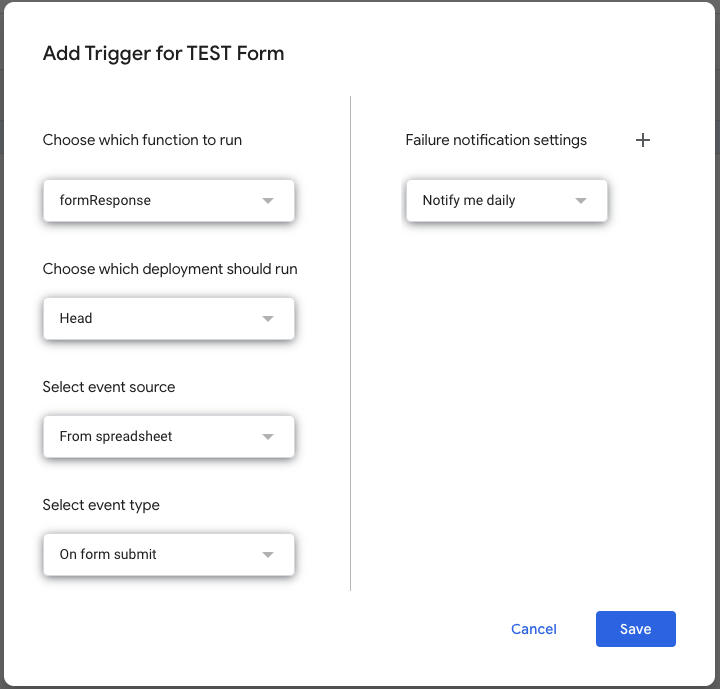

# Chapter #5 Google Apps Script with Google Forms

```javascript
function formResponse(e) {
  var results = e.namedValues;
  console.log(results);
}
```

```javascript
function formResponse(e) {
  var results = e.namedValues;
  console.log('Form submission received:');
  
  for (var key in results) {
    if (results.hasOwnProperty(key)) {
      console.log(key + ': ' + results[key]);
    }
  }
}
```

### Triggers set up

